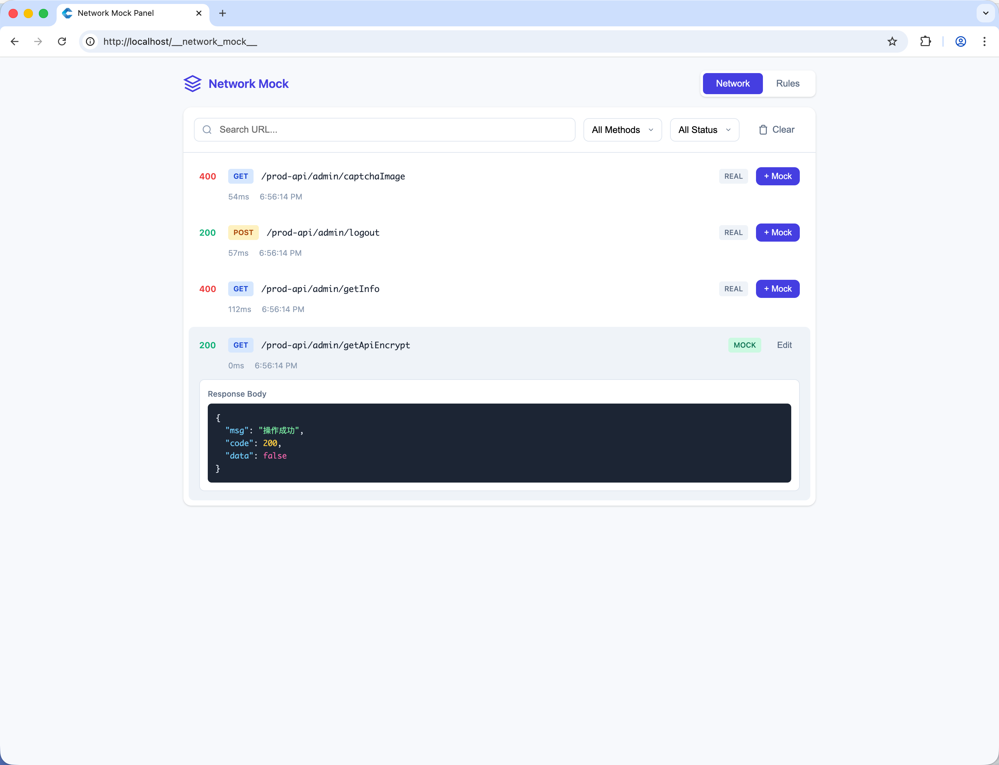
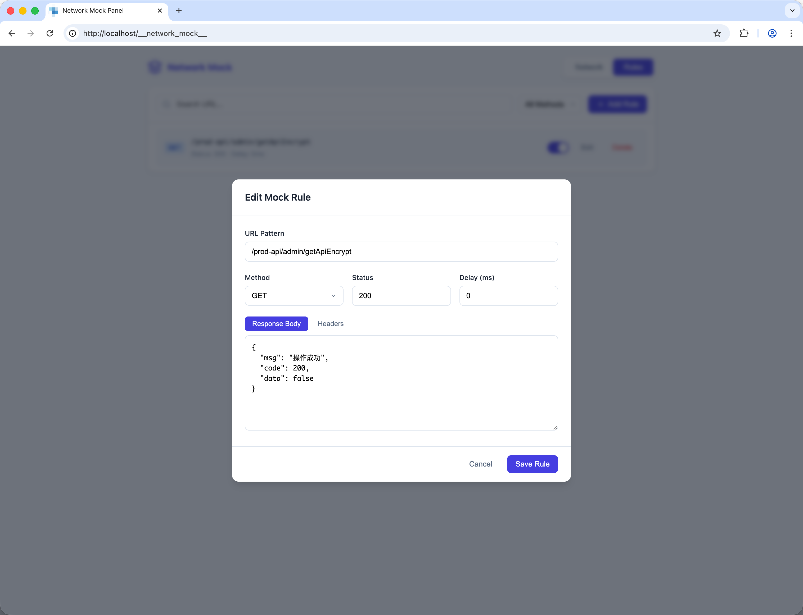

# vite-plugin-network-mock

A Vite plugin for monitoring network requests with built-in mock capabilities. Provides a visual panel to inspect API requests and create mock rules on-the-fly during development.

[中文文档](./docs/README.zh-CN.md)

## Screenshots

### Network Monitor Panel


### Mock Rules Management


## Features

- 🔍 Real-time network request monitoring
- 🎭 Dynamic mock rule creation without code changes
- 📊 Visual panel for request inspection
- 💾 Persistent mock rules across dev server restarts
- ⏱️ Response delay simulation
- 🔄 WebSocket-based real-time updates

## Installation

```bash
npm install vite-plugin-network-mock --save-dev
# or
yarn add vite-plugin-network-mock -D
# or
pnpm add vite-plugin-network-mock -D
```

## Usage

### Basic Setup

```ts
// vite.config.ts
import { defineConfig } from 'vite'
import networkMock from 'vite-plugin-network-mock'

export default defineConfig({
  plugins: [
    networkMock()
  ]
})
```

### With Options

```ts
// vite.config.ts
import { defineConfig } from 'vite'
import networkMock from 'vite-plugin-network-mock'

export default defineConfig({
  plugins: [
    networkMock({
      enabled: true,                    // Enable/disable the plugin
      panelPath: '/__network_mock__',   // URL path to access the panel
      include: ['/api/', '/prod-api/'], // URL patterns to intercept
      exclude: ['/__', '/@']            // URL patterns to ignore
    })
  ]
})
```

### Accessing the Panel

After starting the dev server, visit:

```
http://localhost:5173/__network_mock__
```

## Configuration Options

| Option | Type | Default | Description |
|--------|------|---------|-------------|
| `enabled` | `boolean` | `true` | Enable or disable the plugin |
| `panelPath` | `string` | `'/__network_mock__'` | URL path for the mock panel |
| `include` | `string[]` | `['/api/', '/prod-api/']` | URL patterns to monitor and mock |
| `exclude` | `string[]` | `['/__', '/@', '/node_modules/', ...]` | URL patterns to ignore |

## Mock Rule Properties

| Property | Type | Description |
|----------|------|-------------|
| `url` | `string` | URL pattern to match (substring match) |
| `method` | `string` | HTTP method (GET, POST, PUT, DELETE, etc.) |
| `status` | `number` | HTTP status code to return |
| `delay` | `number` | Response delay in milliseconds |
| `response` | `any` | Mock response body (JSON) |
| `enabled` | `boolean` | Enable/disable this rule |

## How It Works

### Architecture Overview

```
┌─────────────────────────────────────────────────────────────┐
│                      Vite Dev Server                        │
├─────────────────────────────────────────────────────────────┤
│  ┌─────────────┐    ┌─────────────┐    ┌─────────────────┐  │
│  │  Middleware │───▶│ Mock Store  │◀───│  WebSocket      │  │
│  │  Interceptor│    │ (Persistent)│    │  Server         │  │
│  └─────────────┘    └─────────────┘    └─────────────────┘  │
│         │                                      ▲            │
│         ▼                                      │            │
│  ┌─────────────┐                      ┌─────────────────┐   │
│  │   Request   │                      │   Mock Panel    │   │
│  │   Response  │                      │   (Browser)     │   │
│  └─────────────┘                      └─────────────────┘   │
└─────────────────────────────────────────────────────────────┘
```

### Core Components

1. **Middleware Interceptor**: Intercepts HTTP requests matching the `include` patterns and checks for matching mock rules.

2. **Mock Store**: Manages mock rules and network logs with file-based persistence in `~/.vite-network-mock/<project-hash>/`.

3. **WebSocket Server**: Enables real-time communication between the panel and the plugin for instant updates.

4. **Panel UI**: A built-in HTML page for viewing logs and managing mock rules.

### Request Flow

1. Client sends a request to the dev server
2. Middleware checks if URL matches `include` patterns (and not `exclude`)
3. If a matching enabled mock rule exists:
   - Apply configured delay
   - Return mock response with specified status
4. If no mock rule matches:
   - Forward request to actual backend
   - Capture and log the response
5. Broadcast log entry to all connected panels via WebSocket

### Data Persistence

Mock rules are stored in the user's home directory:
```
~/.vite-network-mock/<project-hash>/
├── rules.json    # Mock rules
└── logs.json     # Network logs (max 500 entries)
```

The `<project-hash>` is an MD5 hash of the project root path, ensuring each project has isolated storage.

## License

MIT
