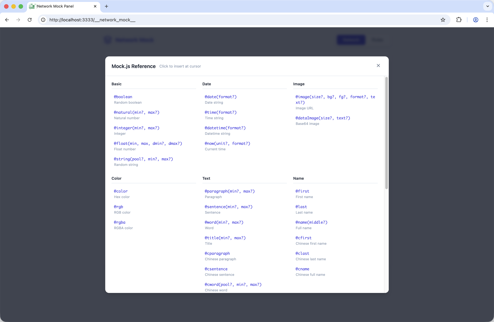

# vite-plugin-network-mock

一个用于监控网络请求并提供内置 Mock 功能的 Vite 插件。提供可视化面板，在开发过程中实时检查 API 请求并动态创建 Mock 规则。

[English](../README.md)

## 截图预览

| 网络监控 | Mock 规则 | Mock.js 参考 |
|:---:|:---:|:---:|
|  |  |  |

## 特性

- 🔍 实时网络请求监控
- 🎭 无需修改代码即可动态创建 Mock 规则
- 📊 可视化面板查看请求详情
- 💾 Mock 规则持久化存储，重启开发服务器后依然有效
- ⏱️ 支持响应延迟模拟
- 🔄 基于 WebSocket 的实时更新
- 🎲 集成 Mock.js，支持生成随机数据
- 📝 支持自定义响应头
- 🔎 请求/响应体预览，支持语法高亮
- 🏷️ 支持按方法、URL、Mock 状态筛选日志
- ⚡ 一键从捕获的请求创建 Mock 规则

## 安装

```bash
npm install vite-plugin-network-mock --save-dev
# 或
yarn add vite-plugin-network-mock -D
# 或
pnpm add vite-plugin-network-mock -D
```

## 使用方法

### 基础配置

```ts
// vite.config.ts
import { defineConfig } from 'vite'
import networkMock from 'vite-plugin-network-mock'

export default defineConfig({
  plugins: [
    networkMock()
  ]
})
```

### 完整配置

```ts
// vite.config.ts
import { defineConfig } from 'vite'
import networkMock from 'vite-plugin-network-mock'

export default defineConfig({
  plugins: [
    networkMock({
      enabled: true,                    // 是否启用插件
      panelPath: '/__network_mock__',   // 面板访问路径
      include: ['/api/', '/prod-api/'], // 需要拦截的 URL 模式
      exclude: ['/__', '/@']            // 需要忽略的 URL 模式
    })
  ]
})
```

### 访问面板

启动开发服务器后，访问：

```
http://localhost:5173/__network_mock__
```

## 配置选项

| 选项 | 类型 | 默认值 | 说明 |
|------|------|--------|------|
| `enabled` | `boolean` | `true` | 是否启用插件 |
| `panelPath` | `string` | `'/__network_mock__'` | Mock 面板的访问路径 |
| `include` | `string[]` | `['/api/', '/prod-api/']` | 需要监控和 Mock 的 URL 模式 |
| `exclude` | `string[]` | `['/__', '/@', '/node_modules/', ...]` | 需要忽略的 URL 模式 |

## Mock 规则属性

| 属性 | 类型 | 说明 |
|------|------|------|
| `url` | `string` | 要匹配的 URL 模式（子字符串匹配） |
| `method` | `string` | HTTP 方法（GET、POST、PUT、DELETE 等） |
| `status` | `number` | 返回的 HTTP 状态码 |
| `delay` | `number` | 响应延迟时间（毫秒） |
| `response` | `any` | Mock 响应体（JSON 格式，支持 Mock.js 语法） |
| `headers` | `object` | 自定义响应头 |
| `enabled` | `boolean` | 是否启用此规则 |

## Mock.js 支持

本插件集成了 [Mock.js](http://mockjs.com/)，支持生成随机 Mock 数据。你可以在响应体中使用 Mock.js 语法：

```json
{
  "code": 200,
  "data": {
    "list|10": [{
      "id": "@id",
      "name": "@cname",
      "email": "@email",
      "avatar": "@image('100x100')",
      "createTime": "@datetime"
    }],
    "total": "@integer(100, 500)"
  }
}
```

常用 Mock.js 占位符：
- `@id` - 随机 ID
- `@name` / `@cname` - 英文/中文姓名
- `@email` - 邮箱地址
- `@datetime` - 日期时间
- `@image` - 占位图片 URL
- `@integer(min, max)` - 随机整数
- `@string(length)` - 随机字符串
- `@boolean` - 随机布尔值
- `@paragraph` / `@cparagraph` - 英文/中文段落

面板内置了 Mock.js 语法参考指南，方便快速查阅。

## 实现原理

### 架构概览

```
┌─────────────────────────────────────────────────────────────┐
│                      Vite 开发服务器                         │
├─────────────────────────────────────────────────────────────┤
│  ┌─────────────┐    ┌─────────────┐    ┌─────────────────┐  │
│  │  中间件     │───▶│ Mock 存储   │◀───│  WebSocket      │  │
│  │  拦截器     │    │ （持久化）   │    │  服务器         │  │
│  └─────────────┘    └─────────────┘    └─────────────────┘  │
│         │                                      ▲            │
│         ▼                                      │            │
│  ┌─────────────┐                      ┌─────────────────┐   │
│  │   请求      │                      │   Mock 面板     │   │
│  │   响应      │                      │   （浏览器）    │   │
│  └─────────────┘                      └─────────────────┘   │
└─────────────────────────────────────────────────────────────┘
```

### 核心组件

1. **中间件拦截器**：拦截匹配 `include` 模式的 HTTP 请求，检查是否有匹配的 Mock 规则。

2. **Mock 存储**：管理 Mock 规则和网络日志，使用文件系统持久化存储在 `~/.vite-network-mock/<项目哈希>/` 目录。

3. **WebSocket 服务器**：实现面板与插件之间的实时通信，确保即时更新。

4. **面板 UI**：内置的 HTML 页面，用于查看日志和管理 Mock 规则。

### 请求处理流程

1. 客户端向开发服务器发送请求
2. 中间件检查 URL 是否匹配 `include` 模式（且不在 `exclude` 中）
3. 如果存在匹配的已启用 Mock 规则：
   - 应用配置的延迟时间
   - 返回指定状态码的 Mock 响应
4. 如果没有匹配的 Mock 规则：
   - 将请求转发到实际后端
   - 捕获并记录响应
5. 通过 WebSocket 将日志条目广播到所有连接的面板

### 数据持久化

Mock 规则存储在用户主目录下：
```
~/.vite-network-mock/<项目哈希>/
├── rules.json    # Mock 规则
└── logs.json     # 网络日志（最多 500 条）
```

`<项目哈希>` 是项目根路径的 MD5 哈希值，确保每个项目有独立的存储空间。

## License

MIT
